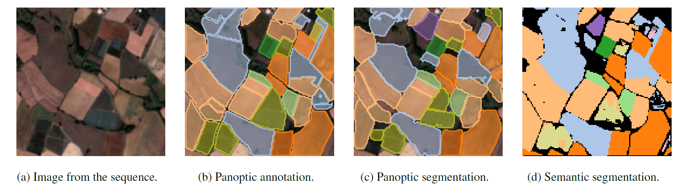

# :ear_of_rice: PASTIS :ear_of_rice: Panoptic Agricultural Satellite TIme Series (optical and radar)



## The PASTIS Dataset

- **Dataset presentation**

PASTIS is a benchmark dataset for panoptic and semantic segmentation of agricultural parcels from satellite time series. 
It contains 2,433 patches within the French metropolitan territory with panoptic annotations (instance index + semantic label for each pixel). Each patch is a Sentinel-2 multispectral image time series of variable lentgh. 

We propose an official 5 fold split provided in the dataset's metadata, and evaluated several of the top-performing image time series networks. You are welcome to use our numbers and to submit your own entries to the leaderboard!

- **Dataset in numbers**

:arrow_forward: 2,433 time series             |  :arrow_forward: 124,422 individual parcels         | :arrow_forward: 18 crop types   
:-------------------------------------------- | :-------------------------------------------------- | :------------------------------
:arrow_forward: **128x128 pixels / images**   | :arrow_forward:  **38-61 acquisitions / series**    | :arrow_forward:  **10m / pixel** 
:arrow_forward:  **10 spectral bands**        | :arrow_forward: **covers ~4,000 km²**                       | :arrow_forward: **over 2B pixels**


- :satellite: *NEW*: **Multimodal PASTIS with Radar (PASTIS-R)**

We extend PASTIS with aligned radar Sentinel-1 observations for all 2433 patches in addition to the Sentinel-2 images. For each patch, we added approximately 70 observations of Sentinel-1 in ascending orbit, and 70 observations in descending orbit. 
PASTIS-R can be used to evaluate optical-radar fusion methods for parcel-based classification, semantic segmentation, and panoptic segmentation.  
For more details on PASTIS-R, refer to our recent paper on multi-modal fusion with attention-based models ([preprint](https://arxiv.org/abs/2112.07558v1)). 

## Updates

- **27.06.2022 Major Bugfix** :beetle: A bug in the panoptic metrics was driving the Recognition Quality down artificially. The bug is now fixed and the metrics have been updated here and on Arxiv. Across experiments, solving this bug improved PQ by ~2-3pts on PASTIS. See [this issue](https://github.com/VSainteuf/utae-paps/issues/11) for more details. If you have been using the PASTIS benchmark, you can simply re-evaluate your models with the corrected implementation.

## Usage 
- **Download** 

The dataset can be downloaded from Zenodo in different formats:
 1. [PASTIS](https://zenodo.org/record/5012942) (29 GB zipped) : The original PASTIS dataset for semantic and panoptic segmentation
    on Sentinel-2 time series (format used for the [ICCV 2021 paper](https://openaccess.thecvf.com/content/ICCV2021/papers/Garnot_Panoptic_Segmentation_of_Satellite_Image_Time_Series_With_Convolutional_Temporal_ICCV_2021_paper.pdf)). [](https://doi.org/10.5281/zenodo.5012942)
 2. [PASTIS-R](https://zenodo.org/record/5735646) (54 GB zipped) : The extended version with Sentinel-1 observations. [](https://doi.org/10.5281/zenodo.5735646)
 3. [PASTIS-R (pixel-set format)](https://zenodo.org/record/5745151) (27 GB zipped) : The PASTIS-R dataset prepared in pixel-set format 
    for parcel-based classification only. See this [repo](https://github.com/VSainteuf/pytorch-psetae) and 
    [paper](https://openaccess.thecvf.com/content_CVPR_2020/html/Garnot_Satellite_Image_Time_Series_Classification_With_Pixel-Set_Encoders_and_Temporal_CVPR_2020_paper.html)
    for more details on this format. [](https://doi.org/10.5281/zenodo.5745151)


- **Data loading** 

This repository also contains a PyTorch dataset class in `code/dataloader.py` 
that can be readily used to load data for training models on PASTIS and PASTIS-R.
For the pixel-set dataset, use the dataloader in `code/dataloader_pixelset.py`. 
The time series contained in PASTIS have variable lengths. The `code/collate.py` 
contains a `pad_collate` function that you can use in the pytorch dataloader to temporally pad shorter sequences. 

- **Metrics** 

We propose a PyTorch implementation of panoptic metrics in `code/panoptic_metrics.py`.
In order to use these metrics, the model's output should contain an instance prediction
and a semantic prediction *for each pixel*.


- **Visualization and Usage** 

See our notebook `demo.ipynb` for example of data manipulation and several visualization functions for semantic and panoptic segmentation.

- **Architectures**

Pre-trained weights and implementation of **U-TAE** and **PaPs** are available on the [model repository](https://github.com/VSainteuf/utae-paps).


## Leaderboard
Please open an issue to submit new entries. Do mention if the work has been published and wether the code accessible for reproducibility. We require that at least a preprint is available to add an entry.


---
### Semantic Segmentation
#### Optical only (PASTIS)
| Model name         | #Params| OA  |  mIoU | Published |
| ------------------ |---- |---- | ---| --- |
| TSViT &dagger;   | 1.6M|    83.4%    |  65.4%| :heavy_check_mark: [link](https://arxiv.org/pdf/2301.04944.pdf)|
| U-TAE   |   1.1M| 83.2%   | 63.1%|  :heavy_check_mark: [link](https://openaccess.thecvf.com/content/ICCV2021/papers/Garnot_Panoptic_Segmentation_of_Satellite_Image_Time_Series_With_Convolutional_Temporal_ICCV_2021_paper.pdf)|
| Unet-3d*   | 1.6M|    81.3%    |  58.4%| :heavy_check_mark: [link](http://openaccess.thecvf.com/content_CVPRW_2019/html/cv4gc/Rustowicz_Semantic_Segmentation_of_Crop_Type_in_Africa_A_Novel_Dataset_CVPRW_2019_paper.html)|
| Unet-ConvLSTM* |1.5M  |     82.1%    |  57.8%| :heavy_check_mark: [link](http://openaccess.thecvf.com/content_CVPRW_2019/html/cv4gc/Rustowicz_Semantic_Segmentation_of_Crop_Type_in_Africa_A_Novel_Dataset_CVPRW_2019_paper.html)|
| FPN-ConvLSTM*  | 1.3M|    81.6%   |  57.1%|:heavy_check_mark: [link](https://www.sciencedirect.com/science/article/pii/S0924271620303142?casa_token=uhkmVE-Lk94AAAAA:r6USZEEFMFE2qc2uYZSrqTzy1_DSI9hflG2cVeay-2Bd-PHFIg3CPwgisf7jatDDfRnR4ROzN9k)|

(*) Models that we re-implemented ourselves are denoted with a star.

(&dagger;) TSViT operates on [PASTIS24](https://github.com/michaeltrs/DeepSatModels/blob/main/README_TSVIT.md), where each sample is split into 24x24px sub-patches.

---

#### Optical+Radar fusion (PASTIS-R)
| Model name         | #Params| OA  |  mIoU | Published |
| ------------------ |---- |---- | ---| --- |
| S1+S2 U-TAE (late fusion) |   1.7M|  **84.2%** | **66.3%**|  :heavy_check_mark: [link](https://arxiv.org/abs/2112.07558v1)|
| S1+S2 U-TAE (early fusion)|   1.6M|  83.8%     | 65.9%    |  :heavy_check_mark: [link](https://arxiv.org/abs/2112.07558v1)|

---

### Panoptic Segmentation
#### Optical only (PASTIS)

| Model name         | #Params| SQ  | RQ | PQ| Published |
| ------------------ |--- |--- | --- |--- |--- |
| U-TAE + PaPs       |1.3M | **81.5**|**53.2** |**43.8**| :heavy_check_mark: [link](https://openaccess.thecvf.com/content/ICCV2021/papers/Garnot_Panoptic_Segmentation_of_Satellite_Image_Time_Series_With_Convolutional_Temporal_ICCV_2021_paper.pdf)|
| U-ConvLSTM + PaPs  |1.7M | 80.2    |43.9     |35.6    | :heavy_check_mark: [link](https://openaccess.thecvf.com/content/ICCV2021/papers/Garnot_Panoptic_Segmentation_of_Satellite_Image_Time_Series_With_Convolutional_Temporal_ICCV_2021_paper.pdf)|

---

#### Optical+Radar fusion (PASTIS-R)

**These values are still affected by the bug in the metrics computation, they will be re-evaluated shortly.**

| Model name         |#Params| SQ  | RQ | PQ|Published |
| ------------------ |--- |--- | --- |--- |--- |
| S1+S2 U-TAE + PaPs (early fusion)  | 1.8M |**82.2**|**50.6** |**42.0**|:heavy_check_mark: [link](https://arxiv.org/abs/2112.07558v1)|
| S1+S2 U-TAE + PaPs (late fusion)   | 2.4M | 81.6   |50.5     |41.6    |:heavy_check_mark: [link](https://arxiv.org/abs/2112.07558v1)|

## Documentation
The agricultural parcels are grouped into 18 different crop classes as shown in the 
table below. The backgroud class corresponds to non-agricultural land, and the void label for parcels that are mostly outside their patch.


Additional information about the dataset can be found in the `documentation/pastis-documentation.pdf` document.

## References
If you use PASTIS please cite the [related paper](https://arxiv.org/abs/2107.07933):
```
@article{garnot2021panoptic,
  title={Panoptic Segmentation of Satellite Image Time Series
with Convolutional Temporal Attention Networks},
  author={Sainte Fare Garnot, Vivien  and Landrieu, Loic },
  journal={ICCV},
  year={2021}
}
```
For the PASTIS-R optical-radar fusion dataset, please also cite [this paper](https://arxiv.org/abs/2112.07558v1):
```
@article{garnot2021mmfusion,
  title    = {Multi-modal temporal attention models for crop mapping from satellite time series},
  journal  = {ISPRS Journal of Photogrammetry and Remote Sensing},
  year     = {2022},
  doi      = {https://doi.org/10.1016/j.isprsjprs.2022.03.012},
  author   = {Vivien {Sainte Fare Garnot} and Loic Landrieu and Nesrine Chehata},
}
```
## Credits

- The satellite imagery used in PASTIS was retrieved from [THEIA](www.theia.land.fr): 
"Value-added data processed by the CNES for the Theia www.theia.land.fr data cluster using Copernicus data.
The treatments use algorithms developed by Theia’s Scientific Expertise Centres. "

- The annotations used in PASTIS stem from the French [land parcel identification system](https://www.data.gouv.fr/en/datasets/registre-parcellaire-graphique-rpg-contours-des-parcelles-et-ilots-culturaux-et-leur-groupe-de-cultures-majoritaire/) produced
 by IGN, the French mapping agency.
 
- This work was partly supported by [ASP](https://www.asp-public.fr), the French Payment Agency. 

- We also thank Zenodo for hosting the datasets. 
